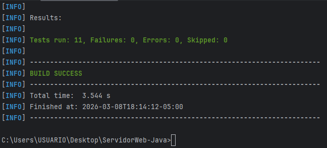
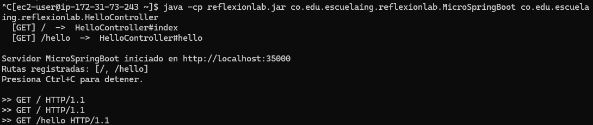
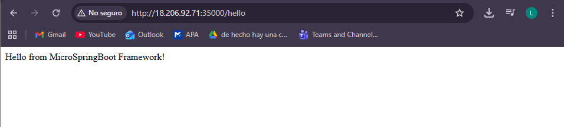

# MicroSpringBoot - Reflexion Lab

Mini framework IoC en Java puro que replica el comportamiento de Spring Boot usando **reflexión y anotaciones personalizadas**, sin ninguna dependencia de Spring.

## Arquitectura

```
reflexionlab/
├── pom.xml
├── .gitignore
└── src/
    ├── main/java/co/edu/escuelaing/reflexionlab/
    │   ├── MicroSpringBoot.java       ← Framework principal (servidor HTTP + IoC)
    │   ├── RestController.java        ← Anotación @RestController
    │   ├── GetMapping.java            ← Anotación @GetMapping
    │   ├── RequestParam.java          ← Anotación @RequestParam
    │   ├── HelloController.java       ← Controlador de ejemplo simple
    │   └── GreetingController.java    ← Controlador con @RequestParam
    ├── main/resources/webroot/
    │   └── index.html                 ← Página estática de ejemplo
    └── test/java/co/edu/escuelaing/reflexionlab/
        └── MicroSpringBootTest.java   ← Tests automatizados (JUnit 5)
```

## Prerrequisitos

- Java 17+
- Maven 3.8+

## Instalación y ejecución

```bash
# 1. Clonar el repositorio
git clone https://github.com/<tu-usuario>/reflexionlab.git
cd reflexionlab

# 2. Compilar
mvn clean compile

# 3. Ejecutar tests
mvn test

# 4. Empacar
mvn package

# 5a. Ejecutar en modo auto-scan (detecta todos los @RestController automáticamente)
java -cp target/reflexionlab.jar co.edu.escuelaing.reflexionlab.MicroSpringBoot

# 5b. Ejecutar pasando la clase por línea de comandos
java -cp target/classes co.edu.escuelaing.reflexionlab.MicroSpringBoot co.edu.escuelaing.reflexionlab.HelloController
```

Abrir en el navegador: **http://localhost:35000**

## Endpoints disponibles

| Ruta | Controlador | Descripción |
|------|-------------|-------------|
| `GET /` | HelloController | Saludo básico |
| `GET /hello` | HelloController | Otro saludo |
| `GET /greeting` | GreetingController | Saludo con nombre por defecto (World) |
| `GET /greeting?name=Ana` | GreetingController | Saludo con nombre personalizado |
| `GET /counter` | GreetingController | Contador de visitas |

## Cómo funciona el framework

### 1. Anotaciones personalizadas

```java
@Retention(RetentionPolicy.RUNTIME)
@Target(ElementType.TYPE)
public @interface RestController { }

@Retention(RetentionPolicy.RUNTIME)
@Target(ElementType.METHOD)
public @interface GetMapping {
    String value(); // path HTTP
}

@Retention(RetentionPolicy.RUNTIME)
@Target(ElementType.PARAMETER)
public @interface RequestParam {
    String value();
    String defaultValue() default "";
}
```

### 2. Controlador de ejemplo con @RequestParam

```java
@RestController
public class GreetingController {

    @GetMapping("/greeting")
    public String greeting(@RequestParam(value = "name", defaultValue = "World") String name) {
        return "Hola " + name;
    }
}
```

### 3. Reflexión en acción

El framework usa `Class.forName()`, `isAnnotationPresent()`, `getDeclaredMethods()` y `method.invoke()` para descubrir y ejecutar los controladores dinámicamente sin ningún acoplamiento en tiempo de compilación.

## Tests automatizados

```bash
mvn test
```

Los tests verifican:
- Presencia de `@RestController` en los controladores
- Presencia de `@GetMapping` con el path correcto
- Presencia de `@RequestParam` con `defaultValue`
- Invocación de métodos por reflexión
- Carga dinámica de clases con `Class.forName()`

Resultado esperado:
```
[INFO] Tests run: 11, Failures: 0, Errors: 0, Skipped: 0
[INFO] BUILD SUCCESS
```

Resultado obtenido:



## Despliegue en AWS EC2

### Prerrequisitos
- Cuenta en AWS
- Java 17 instalado localmente
- Maven instalado localmente

### Paso 1 — Crear la instancia EC2
1. Ingresar a [https://aws.amazon.com](https://aws.amazon.com) e iniciar sesión
2. Buscar el servicio **EC2** y hacer clic en **Launch Instance**
3. Configurar:
    - **Name:** `ServidorWeb-Java`
    - **AMI:** Amazon Linux 2023
    - **Instance type:** `t2.micro` (capa gratuita)
    - **Key pair:** crear nuevo → nombre `reflexionlab-key` → RSA → `.pem` → descargar y guardar
4. Hacer clic en **Launch Instance**

### Paso 2 — Abrir el puerto 35000
1. Ir a **Instances** → seleccionar la instancia → pestaña **Security**
2. Hacer clic en el **Security Group** → **Edit inbound rules** → **Add rule**:
    - Type: `Custom TCP`
    - Port: `35000`
    - Source: `0.0.0.0/0`
3. Hacer clic en **Save rules**

### Paso 3 — Conectarse a la instancia desde Windows
```powershell
ssh -i C:\Users\USUARIO\Downloads\reflexionlab-key.pem ec2-user@<IP-PUBLICA>
```

### Paso 4 — Instalar Java en la instancia
```bash
sudo yum install java-17-amazon-corretto -y
java -version
```

### Paso 5 — Subir el JAR desde Windows
Primero generar el JAR localmente:
```bash
mvn clean package -DskipTests
```
Luego copiarlo a la instancia desde PowerShell:
```powershell
scp -i C:\Users\USUARIO\Downloads\reflexionlab-key.pem target\reflexionlab.jar ec2-user@<IP-PUBLICA>:~
```

### Paso 6 — Ejecutar el servidor
```bash
java -cp reflexionlab.jar co.edu.escuelaing.reflexionlab.MicroSpringBoot co.edu.escuelaing.reflexionlab.HelloController
```

### Paso 7 — Verificar el despliegue
Abrir en el navegador:
```
http://<IP-PUBLICA>:35000/
http://<IP-PUBLICA>:35000/hello
```

## Evidencia de despliegue en AWS EC2

### Servidor corriendo en la instancia



### Endpoint /hello respondiendo desde AWS

